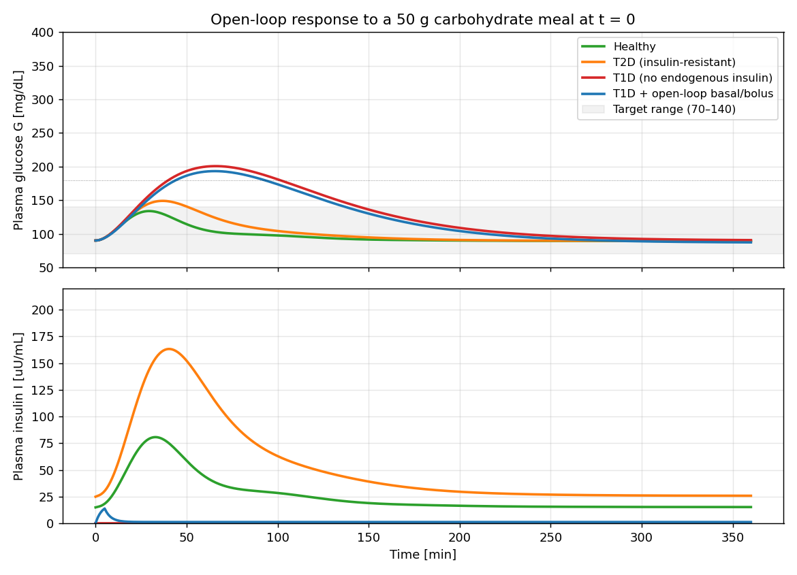
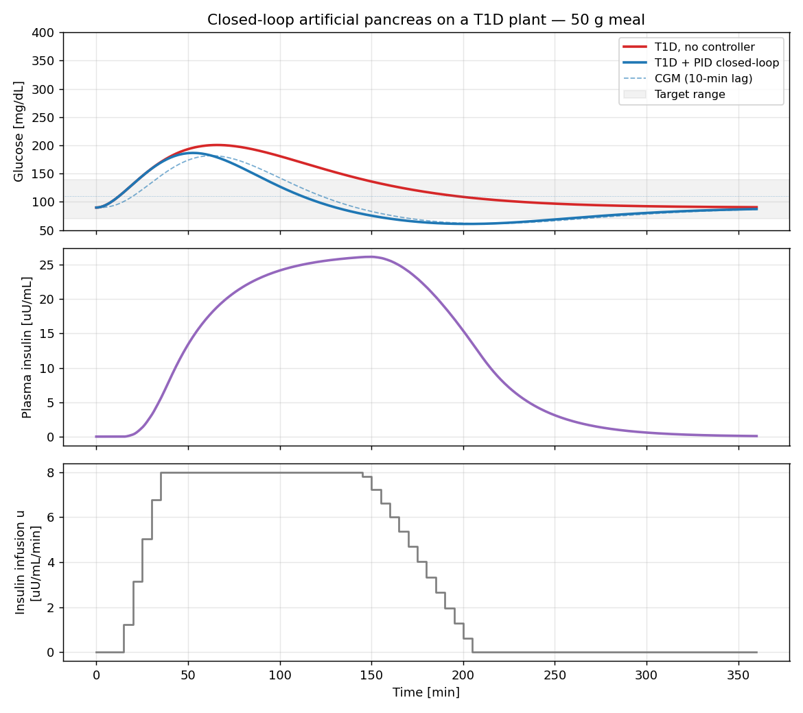
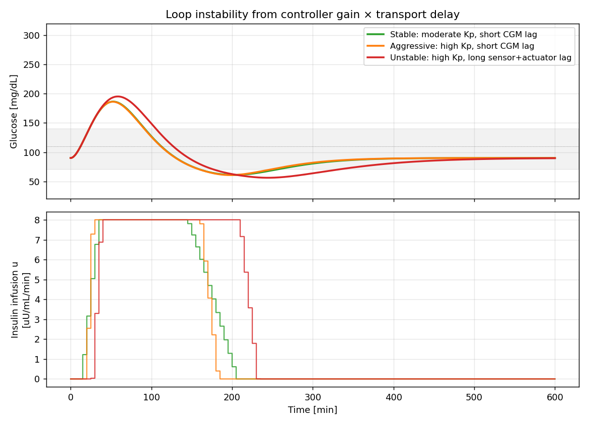

# The Glucose–Insulin Control Loop

> *Deep dive #1. Paired simulation: [`sims/01_glucose_insulin.py`](../sims/01_glucose_insulin.py).*

If you sit a healthy adult down with a 50 g bowl of rice, their blood glucose will rise from ~90 mg/dL to ~135 mg/dL over half an hour and return to baseline within three. They are not thinking about it. Their pancreas has just rejected a step disturbance of about 45 grams of glucose injected into a 12 L plasma pool, using a chemical actuator with a 30-minute transport delay, in a loop whose three time constants span two orders of magnitude. This is one of the more elegant control systems on Earth, and it is sitting inside your abdomen.

This piece dissects that loop the way an engineer would: identify the plant, the sensor, the actuator, the controller, and then linearize the whole thing and stare at the poles. Then we'll look at what breaks when each piece fails (the diabetes spectrum) and at the engineering challenge of replacing the loop externally — the artificial pancreas.

## 1. The plant

The *plant* is the body's glucose pool: roughly 12 g of glucose dissolved in a distribution volume $V_G \approx 12 \text{ L}$ (give or take, depending on whose convention you use — the literature variously reports 0.16–0.22 L/kg).

Glucose enters the pool from two sources:

- **Meals** — intermittent, large (50–100 g over a few hours), with a delay-and-decay profile set by gastric emptying and intestinal absorption.
- **Hepatic glucose production** — continuous, ~2 mg/kg/min at rest, modulated downward by insulin and upward by glucagon, epinephrine, cortisol, and growth hormone.

Glucose leaves the pool through:

- **Brain** — ~120 g/day, essentially constant, insulin-*independent*. The brain has a non-negotiable load that the controller cannot reduce.
- **Muscle and adipose tissue** — large, variable, *insulin-dependent*. These are the controllable sinks.
- **Kidney** — overflow only. Below the renal threshold (~180 mg/dL), zero loss. Above it, glucose spills into urine — a hard limiter on hyperglycemia at the cost of energy waste and osmotic diuresis.

Already this tells you something about the control problem. The disturbance is large relative to the steady-state stock (a meal can be 4× the total plasma glucose mass), the dominant load is uncontrollable (brain), and the sink that *is* controllable is on the far side of a slow chemical actuator. The setpoint band is narrow: clinical normal is 70–140 mg/dL, with cognitive impairment below 50 and tissue damage above ~180 sustained.

## 2. Sensors and actuators

Both live in the pancreatic islets of Langerhans — about a million islets, each a few hundred cells, scattered through the pancreas like seasoning.

| Cell type | Senses | Releases | Effect |
|---|---|---|---|
| β-cell | high glucose | insulin | drives glucose into muscle/fat, suppresses hepatic production |
| α-cell | low glucose | glucagon | mobilizes hepatic glycogen → glucose |

The β-cell is the primary sensor for hyperglycemia and the primary actuator's driver. It does something control engineers should recognize: when glucose rises, β-cells release insulin in **two phases**:

- **First phase** — a sharp ~5-minute burst, proportional to the *rate* of glucose rise.
- **Second phase** — a sustained release, proportional to the *level* of glucose above a threshold.

In other words: the β-cell is a **PD controller** with a low-pass filter on the D term. The proportional gain handles steady-state level; the derivative gain pre-empts overshoot by reacting to the rise. Loss of first-phase release is one of the earliest signs of β-cell dysfunction — a clinical observation that maps cleanly onto an engineering intuition (derivative action is fragile; it dies first).

The α-cell mirrors this in the opposite direction, releasing glucagon when glucose falls. Together α + β + their downstream actions make a true bidirectional controller — something an artificial pancreas with insulin alone cannot replicate, which we'll return to in §8.

## 3. The block diagram

```mermaid
flowchart LR
    Meal[Meal D&#40;t&#41;<br/>disturbance] -->|R_meal| GP[Glucose pool<br/>G&#40;t&#41;]
    GP -->|G| Beta[β-cell<br/>PD: K_p + K_d s]
    Beta -->|Insulin I| Action[Remote insulin<br/>X = ∫ p_3&#40;I-I_b&#41; e^&#40;-p_2 t&#41;]
    Action -.->|−X·G| GP
    GP -->|G| Alpha[α-cell<br/>low-G alarm]
    Alpha -->|Glucagon| Liver[Hepatic<br/>glucose output]
    Liver -.->|+| GP
    HBO[Brain/RBC<br/>constant load] -.->|−| GP
    
    classDef sensor fill:#fde,stroke:#a59
    classDef actuator fill:#def,stroke:#59a
    classDef plant fill:#efd,stroke:#5a9
    classDef disturb fill:#fed,stroke:#a95
    class Beta,Alpha sensor
    class Action,Liver actuator
    class GP plant
    class Meal,HBO disturb
```



Two negative-feedback loops sharing the plant:

- **Inner (β → I → X)** rejects positive glucose excursions. Time constants: insulin clearance ~3 min, insulin action onset ~20–30 min.
- **Counter (α → glucagon → liver)** rejects negative excursions. Time constants similar.

A second-tier outer loop adds cortisol, epinephrine, and growth hormone — slow, broad-spectrum counter-regulation that mobilizes glucose during stress and sustained hypoglycemia. We'll treat this as a constant disturbance for our purposes.

## 4. The Bergman minimal model

The canonical reduced-order model is Bergman's *minimal model* (1979/1981), originally fit to IVGTT data to estimate insulin sensitivity. It uses three state variables:

- $G(t)$ — plasma glucose, mg/dL
- $X(t)$ — "remote insulin action," 1/min (the effective insulin acting on disposal)
- $I(t)$ — plasma insulin, μU/mL

The equations:

$$
\dot G = -p_1 (G - G_b) - X \cdot G + R_{\text{meal}}(t)
$$

$$
\dot X = -p_2 X + p_3 (I - I_b)
$$

$$
\dot I = -n (I - I_b) + S(G) + u_{\text{ext}}(t)
$$

Parameter dictionary (rounded, for an average 70 kg adult):

| Param | Value | Meaning | Engineering name |
|---|---|---|---|
| $p_1$ | 0.028 min⁻¹ | basal glucose effectiveness | self-clearance pole |
| $p_2$ | 0.05 min⁻¹ | insulin action decay | actuator-effect pole |
| $p_3$ | 4×10⁻⁵ (1/min)/(μU/mL) | insulin sensitivity | actuator gain |
| $n$ | 0.30 min⁻¹ | insulin clearance | insulin-pool pole |
| $V_G$ | 117 dL | distribution volume | plant volume |
| $G_b$ | 90 mg/dL | basal glucose | operating point |
| $I_b$ | 15 μU/mL | basal insulin | operating point |

The β-cell secretion $S(G)$ is variously modeled. A pedagogically clean form (used in the paired sim) is a linear rectifier:

$$
S(G) = \gamma \cdot \max(G - h, 0)
$$

with $\gamma \approx 0.45$ μU/mL/min per (mg/dL) and threshold $h \approx 89$ mg/dL. This captures the second-phase response; first-phase release would add a term proportional to $\dot G^+$ (positive part of the glucose derivative).

The meal disturbance $R_{\text{meal}}(t)$ comes from a two-compartment gut model:

$$
\dot q_{\text{sto}} = -k_{\text{emp}} q_{\text{sto}}, \quad
\dot q_{\text{gut}} = k_{\text{emp}} q_{\text{sto}} - k_{\text{abs}} q_{\text{gut}}, \quad
R_{\text{meal}} = \frac{f \cdot k_{\text{abs}} \cdot q_{\text{gut}}}{V_G}
$$

with $q_{\text{sto}}(0) = D_{\text{meal}}$ (the carb load in mg), $k_{\text{emp}} \approx 0.025$, $k_{\text{abs}} \approx 0.04$. The output $R_{\text{meal}}(t)$ is a gamma-like pulse peaking around 20–30 minutes after the meal — roughly what physiologic glucose-appearance studies show.

The exogenous term $u_{\text{ext}}$ is where the artificial pancreas plugs in (§8).

## 5. Linearization around the operating point

Define small-signal variables $g = G - G_b$, $x = X$, $i = I - I_b$. The product term $-X G$ becomes $-X G_b - G_b x \approx -G_b x$ to first order (since $X G_b \ll p_1 G_b$ for small $X$ near the operating point). The linearized system:

$$
\dot g = -p_1 g - G_b\, x + d(t)
$$

$$
\dot x = -p_2 x + p_3 i
$$

$$
\dot i = -n i + K\, g
$$

where $K$ is the β-cell proportional gain ($K = \gamma$ when $G > h$). In the Laplace domain, breaking the loop at $g$, the open-loop transfer function from the loop input to the same point is:

$$
L(s) = \frac{G_b \cdot p_3 \cdot K}{(s + p_1)(s + p_2)(s + n)}
$$

Three first-order real poles. Plugging in numbers:

| Pole | Value | Time constant | What it is |
|---|---|---|---|
| $-p_1$ | −0.028 | ~36 min | glucose self-clearance |
| $-p_2$ | −0.050 | ~20 min | insulin action |
| $-n$ | −0.30 | ~3 min | insulin clearance |

One fast pole (insulin clearance) and two slow ones (the actual control authority). Loop crossover sits in the slow band.

**DC loop gain** governs steady-state disturbance rejection:

$$
L(0) = \frac{G_b \cdot p_3 \cdot K}{p_1 \cdot p_2 \cdot n}
= \frac{90 \cdot 4\!\times\!10^{-5} \cdot 0.45}{0.028 \cdot 0.05 \cdot 0.30} \approx 38.6
$$

That's a healthy DC gain — substantial steady-state disturbance attenuation, but **not infinite**, so there's no perfect tracking. The β-cell is fundamentally a P controller; the integral effect that does exist in real physiology comes from longer-timescale insulin granule depletion/repletion and hepatic glycogen dynamics. Crucially, this means after a meal the system *returns* to basal, but a sustained glucose load (a continuous infusion) would settle at a slightly elevated steady-state — exactly what happens in early Type 2 diabetes before β-cell exhaustion.

**Closed-loop poles** are the roots of $1 + L(s) = 0$:

$$
(s + p_1)(s + p_2)(s + n) + G_b\, p_3\, K = 0
$$

For our healthy numbers this stays well in the left half-plane — open-loop stability is preserved with comfortable margins. We'll see in §8 what happens when you replace the in-pancreas controller with an external pump.

## 6. The β-cell as a PD controller — and why first-phase matters

Looking just at the secretion equation $\dot I = -n(I-I_b) + S(G)$, an instantaneous step in $G$ above threshold drives $I$ exponentially toward $S(G)/n + I_b$ with time constant $1/n \approx 3 \text{ min}$. Pure P control on glucose, with the insulin pool itself acting as a low-pass filter.

Adding first-phase release means a transient term proportional to $\dot G^+$ — a true derivative. The combined action looks like:

$$
\dot I_{\text{secreted}} \approx K_p (G - h)^+ + K_d (\dot G)^+ - n(I - I_b)
$$

This is a discretized PD with a built-in actuator low-pass. From a control-theory standpoint, the derivative action exists to compensate for the slow $X$ dynamics (the $1/p_2 \approx 20$ min actuator-effect pole). Without it, the loop overshoots on fast disturbances; with it, the controller anticipates the rise and starts pushing insulin before glucose has actually deviated from the threshold.

**Clinical correlate:** loss of first-phase insulin release is among the *earliest* abnormalities in pre-diabetes, often years before fasting glucose changes. Engineering intuition predicts this: derivative action is the most fragile control mode — sensitive to noise, dependent on healthy fast dynamics. As β-cells age or stress, D dies first, P limps on for a while, then everything falls apart.

## 7. Simulating the loop — meal response across phenotypes

Running the model with healthy parameters, with reduced insulin sensitivity ($p_3$ down 3.5×) and compensatory hyperinsulinemia ($I_b$ and $\gamma$ raised) for Type 2, and with $\gamma = 0$, $I_b = 0$ for Type 1:



The green (Healthy) trace is the textbook response: peak ~135 mg/dL at ~30 min, return to baseline by 200 min, plasma insulin peaks at ~80 μU/mL. Time-in-range is 100%.

The orange (T2D) trace is the most informative. The glucose peak is only modestly elevated (~150 mg/dL) — but achieving that takes **enormous insulin** (peaks at ~180 μU/mL, sustained elevation for hours). This is the hyperinsulinemic-compensated phase of Type 2 that can last a decade before β-cells finally fail. The cost is paid in chronic hyperinsulinemia (which itself drives weight gain and further resistance — a positive feedback that eventually breaks the loop).

The red (T1D) trace is the open-loop response: glucose climbs above 200 mg/dL and only declines via $p_1$ (non-insulin-mediated clearance) plus the meal absorption tapering off. This is what an uncontrolled Type 1 diabetic experiences after every meal — sustained hyperglycemia, with downstream tissue damage proportional to area-under-curve.

The blue (T1D + basal/bolus) trace illustrates a striking point: a simple open-loop bolus at $t=0$ barely helps. Why? Because in our model the bolus is injected directly into the plasma compartment (we're being kind to the patient). Even so, the insulin dose is small relative to what real β-cells deliver. Real-world subcutaneous insulin injection is *even harder*: the bolus has to traverse a 30–60 minute subcutaneous-to-plasma transport delay (modeled explicitly in §8), so by the time it acts the glucose peak has already happened. **This is the central engineering problem of insulin therapy: the actuator is delayed relative to the disturbance.**

## 8. Closing the loop: the artificial pancreas

The engineering question of the last 50 years: can an external system, with a continuous glucose monitor (CGM), an insulin pump, and an algorithm, replace the β-cell?

The setup:

```
[meal] ──> [glucose plant] ──> [CGM, 10-min lag] ──> [PID/MPC] ──> [pump] ──> [SC tissue, 30-min lag] ──> [plasma I] ──> [X] ──> [plant]
```

Two delays now sit inside the loop: a CGM transport lag (~10 min, interstitial glucose vs. plasma) and a subcutaneous insulin transport lag (~30 min, the dominant problem). The augmented model:

$$
\dot I_{\text{sc}} = -k_{\text{sc}} I_{\text{sc}} + u_{\text{pump}}, \quad
\dot I = k_{\text{sc}} I_{\text{sc}} - n(I - I_b)
$$

with $k_{\text{sc}} = 1/30$ min⁻¹ for 30-minute SC transport.

Running a PID on the T1D plant ($K_p = 0.10$, $K_i = 0.003$, $K_d = 2.0$):



Three observations:

1. **The controller saturates** at $u_{\max} = 8$ μU/mL/min from ~30 to ~150 min — it is pushing as hard as it safely can.
2. **The post-meal peak is barely reduced** (185 vs. 200 mg/dL) — because the insulin is in transit through the SC compartment when glucose is already rising. The transport delay defeats the controller during the disturbance.
3. **Glucose then crashes** to ~62 mg/dL around $t=200$ — the **insulin-on-board** problem. By the time the controller realizes glucose is back near setpoint, large amounts of insulin are already deposited in subcutaneous tissue and *will* keep being delivered to plasma over the next 30+ minutes. The controller can stop pumping, but it cannot recall what's already in flight.

This is why PID artificial-pancreas systems are clinically marginal and why **MPC has won** the commercial space (Tandem Control-IQ, Medtronic 780G, etc.). MPC explicitly models the insulin-on-board state and the transport dynamics, and computes a control sequence that respects those constraints over a finite horizon. It also accepts meal announcements as feedforward — the user tells the system about an upcoming meal and the controller pre-empts the rise.

### Delay-induced instability

If you crank gains too high on the PID, or if the transport delays get worse (e.g., poor injection site absorption, sensor in adipose tissue), the loop starts to ring:



The red trace (high $K_p$, 60-minute SC delay) overshoots both ways — higher peak, deeper hypoglycemic undershoot. This is the classical phase-margin pathology: gain × delay → phase lag at crossover → reduced stability margin → oscillation. In an artificial pancreas, "oscillation" doesn't mean a benign harmonic — it means the patient's blood sugar swinging between dangerous hyper and hypo. Modern AP systems include explicit IOB ceilings, predictive low-glucose suspend, and conservative gain tuning specifically to avoid this regime.

### Why a single hormone is not enough

Insulin is a **unidirectional actuator**. You can give it; you cannot un-give it. When the closed loop drives glucose below setpoint, the controller can only sit at $u = 0$ and wait for residual insulin to clear — which takes 30+ minutes. During that time the patient *must* eat carbohydrate to recover (or use an emergency glucagon injection). The physiologic system handles this with α-cells and glucagon — a true counter-actuator with comparable speed.

**Bi-hormonal artificial-pancreas systems** (e.g., Beta Bionics' iLet) are now in clinical use, adding a second pump for glucagon. They restore the symmetry of physiological control and dramatically reduce hypoglycemia. From a control-theory standpoint, they turn a one-quadrant actuator (insulin only) into a four-quadrant one (push or pull) — the kind of upgrade that almost always unlocks a step change in achievable performance.

## 9. Failure modes as control-system pathologies

The diabetes spectrum maps almost line-for-line onto control-system fault modes:

| Failure mode | Mechanism | Engineering analog |
|---|---|---|
| **Type 1** | autoimmune β-cell destruction | sensor + actuator-driver loss; system runs open-loop |
| **MODY** | monogenic β-cell defects | sensor calibration drift or controller bug |
| **Type 2 (early)** | peripheral insulin resistance → $p_3$ drops | actuator gain loss; compensated by raising operating point ($I_b$ up) |
| **Type 2 (late)** | β-cell exhaustion after years of overdrive | controller burnout — actuator can no longer be pushed harder |
| **Brittle diabetes** | aggressive SC dosing + variable absorption | high gain × variable delay → loop instability |
| **Hypoglycemia unawareness** | counter-regulatory desensitization | watchdog timer failure; no low-side alarm |
| **Dawn phenomenon** | nocturnal cortisol/GH surge raises hepatic output | scheduled disturbance overwhelms basal-rate feedforward |
| **Stress hyperglycemia** | catecholamines drive glycogenolysis | override input from a faster outer loop |

Note the symmetry: Type 1 is *sensor loss* (the β-cells can't sense glucose because they're gone). Type 2 is *receptor desensitization* (the actuator output produces less plant response). They're entirely different failure modes that happen to disrupt the same controlled variable.

## 10. Five takeaways

1. **The β-cell is a PD controller**, with the proportional channel ($\gamma$) and derivative channel (first-phase release) implemented in different cellular machinery. They fail independently, and the derivative channel fails first.

2. **Loop gain is large but finite** — the body returns to basal after a meal, but a sustained disturbance produces a small steady-state error. There's no integrator in the fast loop; integral-like behavior comes from slower secondary processes.

3. **The dominant control challenge is transport delay**, not insufficient gain. Insulin takes 20–30 minutes to act even in the native system; another 30 minutes is added by subcutaneous injection in artificial systems. Phase margin is the binding constraint.

4. **The natural loop is bidirectional** (α + β cells), and that is essential. Single-hormone artificial systems pay for the missing direction in hypoglycemia risk.

5. **The diabetes spectrum is a taxonomy of control-system fault modes.** Sensor loss (T1), gain collapse (T2 early), controller burnout (T2 late), and instability from external dosing (brittle) are all distinct engineering pathologies that happen to look superficially similar at the patient level.

## References & further reading

- Bergman RN, Ider YZ, Bowden CR, Cobelli C. **Quantitative estimation of insulin sensitivity.** *Am J Physiol Endocrinol Metab*, 1979;236(6):E667–77. *(original minimal model)*
- Dalla Man C, Rizza RA, Cobelli C. **Meal simulation model of the glucose-insulin system.** *IEEE Trans Biomed Eng*, 2007;54(10):1740–9. *(realistic gut absorption + extended model — basis of the UVA/Padova simulator approved by FDA for AP testing)*
- Cobelli C, Renard E, Kovatchev B. **Artificial pancreas: past, present, future.** *Diabetes*, 2011;60(11):2672–82.
- Doyle FJ III, Huyett LM, Lee JB, Zisser HC, Dassau E. **Closed-loop artificial pancreas systems: engineering the algorithms.** *Diabetes Care*, 2014;37(5):1191–7.
- Steil GM. **Algorithms for a closed-loop artificial pancreas: the case for proportional-integral-derivative control.** *J Diabetes Sci Technol*, 2013;7(6):1621–31.
- Russell SJ et al. **Outpatient glycemic control with a bionic pancreas in type 1 diabetes.** *N Engl J Med*, 2014;371:313–25. *(bi-hormonal AP)*

## What the paired simulation covers

[`sims/01_glucose_insulin.py`](../sims/01_glucose_insulin.py) implements the extended Bergman model with two-compartment gut absorption and (for the closed-loop figures) a subcutaneous insulin transport compartment. It produces three figures:

- `meal_response.png` — open-loop 50 g meal across healthy / T2D / T1D / T1D + basal-bolus phenotypes
- `artificial_pancreas.png` — PID closed-loop on a T1D plant with realistic CGM and SC delays
- `delay_instability.png` — same controller with varying gain × delay, showing margin erosion

Run with `python sims/01_glucose_insulin.py` from the project root after activating the venv.

---

*Next deep-dive candidates from the inventory: respiratory CO₂ control (Cheyne–Stokes as a textbook delay-induced instability story), or the baroreceptor reflex + RAAS cascade.*
